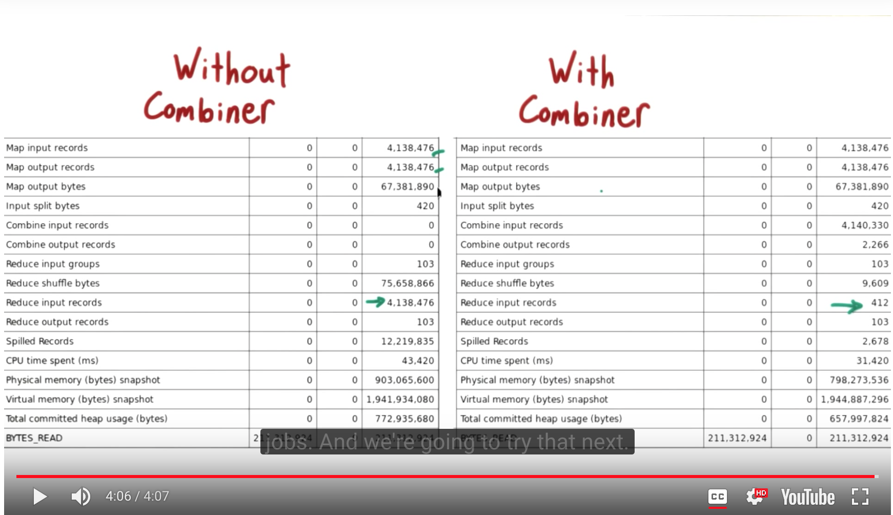

How to run example
==================

Assuming you have *$HADOOP_HOME* declared, you could run this mapper-combiner-reducer example doing:
(*$HADOOP_HOME* should look something like `/usr/local/Cellar/hadoop/2.8.2`)
```
$HADOOP_HOME/bin/hadoop jar  $HADOOP_HOME/libexec/share/hadoop/tools/lib/hadoop-streaming-2.8.2.jar
-mapper ./ex10-mapper-salesPerDay.py
--reducer ./ex10-reducer-salesPerDay.py
--combiner ./ex10-combiner-salesPerDay.py
-file ./ex10-mapper-salesPerDay.py
-file ./ex10-reducer-salesPerDay.py
-file ./ex10-combiner-salesPerDay.py
-input purchases -output outputSales3
```

Benefits of using combiners
===========================
- Combiner code gets run on the map machine, saves bandwith when communicating to the machine where the reducer is.
- Decreases the number of input records on the reducer part.

